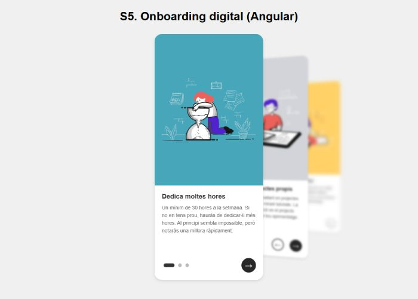

# S5.-Onboarding Digital Angular

<p align="center">
  
</p>

## 📄 Descripción

Este repositorio contiene una aplicación de **OnBoarding digital** desarrollada con **Angular**. La aplicación está diseñada para mostrar 3 cards utilizando una interfaz interactiva y dinámica.

## ✨ Características

- **Interfaz Intuitiva**: Proporciona una experiencia de usuario clara y amigable para el proceso de OnBoarding.
- **Componentes Modulares**: Arquitectura basada en componentes para facilitar la reutilización y el mantenimiento del código.
- **Navegación Fluida**: Permite moverse de manera dinámica entre diferentes pasos del OnBoarding.

## 💻 Tecnologías Utilizadas

- **Angular CLI** version 19.0.6.
- **HTML5**
- **TypeScript**
- **SCSS** 

## 📋 Requisitos

- **Node.js** y **npm** instalados en tu sistema. Descárgalos desde [nodejs.org](https://nodejs.org/).
- Angular CLI instalado globalmente:
  ```bash
  npm install -g @angular/cli
  ```

## 🛠️ Instalación

**✔️ Paso 1:** Clona este repositorio en tu máquina local:
```bash
git clone https://github.com/basantades/S5.-Onboarding-digital-Angular-.git
```

**✔️ Paso 2:** Ingresa al directorio del proyecto:
```bash
cd S5.-Onboarding-digital-Angular-
```

**✔️ Paso 3:** Instala las dependencias necesarias:
```bash
npm install
```

## ▶️ Ejecución

Para iniciar la aplicación en un entorno de desarrollo, ejecuta:
```bash
ng serve
```
Luego, abre tu navegador y navega a `http://localhost:4200/` para ver la aplicación en acción.

## 🤝 Contribuciones

Si deseas colaborar en este proyecto o reportar algún problema, sigue estos pasos:

1. Crea un **issue** para reportar errores o sugerir mejoras.
2. Envía un **pull request** con tus contribuciones.
3. Asegúrate de seguir las **buenas prácticas** de desarrollo y de probar tus cambios antes de enviarlos.

---

Este README proporciona una guía básica para configurar, utilizar y contribuir al proyecto de OnBoarding Digital Angular. Asegúrate de consultar la documentación oficial de Angular para obtener información más detallada y actualizaciones.

